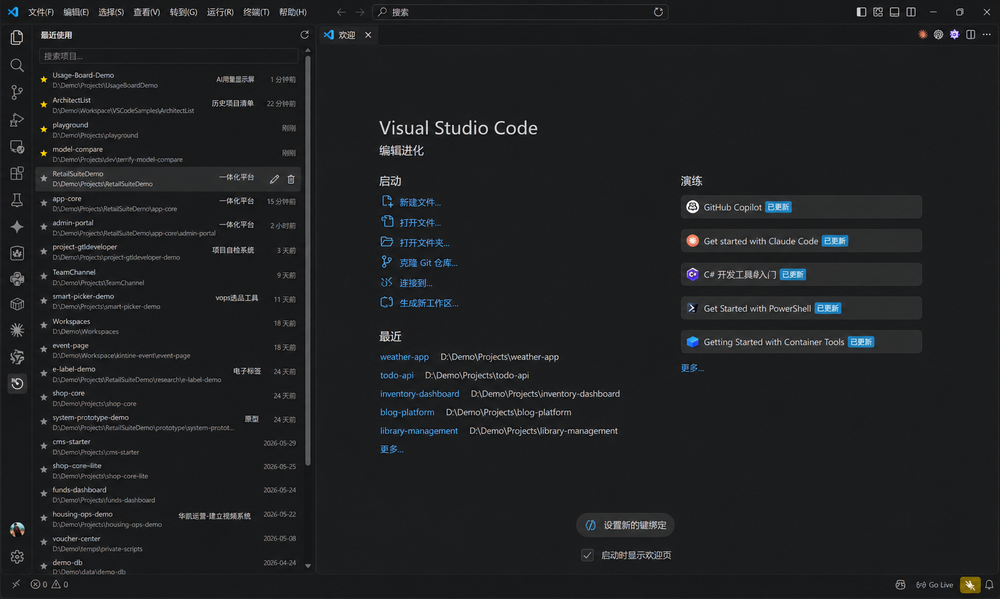

# Recent Project · 最近项目

> 在 VS Code 侧边栏常驻展示最近打开的项目，支持备注、置顶、一键打开，无需重复维护历史数据——直接读取 VS Code 自身的最近历史。



## ✨ 功能特性

- **读取原生历史**：从 VS Code 自身的存储（`state.vscdb` / `storage.json`）读取最近项目，兼容 Code / Insiders / VSCodium / Cursor，跨 Windows / macOS / Linux
- **一键打开**：单击在当前窗口打开；`Ctrl`（macOS `Cmd`）单击在新窗口打开
- **轻量管理**：置顶、添加/清除备注、从列表移除（墓碑机制，不会被历史"复活"）
- **快速搜索**：按项目名 / 路径 / 备注关键字过滤
- **自动隐藏**：文件夹已不存在的项目不显示
- **编辑时间**：展示每个项目文件夹内最近一次编辑的时间，置顶项最前
- **中英双语**：跟随 VS Code 显示语言

## 📦 安装

本地安装（当前为自用阶段）：

```bash
npm run package                          # 构建并生成 .vsix
code --install-extension recent-project-0.1.1.vsix
```

> 上架 VS Code Marketplace 后此处会补充一键安装入口。

## 🚀 使用

1. 点击活动栏的「最近项目」图标打开侧边栏
2. **单击**项目 → 当前窗口打开；**Ctrl/Cmd + 单击** → 新窗口打开
3. 星标 = 置顶；编辑按钮 = 备注；垃圾桶 = 从列表移除
4. 顶栏搜索框按名称 / 路径 / 备注过滤

## 🗂 数据来源

插件不另存一份历史，而是按优先级读取 VS Code 原生存储：

1. `state.vscdb` → `history.recentlyOpenedPathsList`
2. `state.vscdb` → `sessions.recentlyPickedWorkspaces`
3. `storage.json` → `profileAssociations.workspaces`
4. `storage.json` → `windowsState.openedWindows` / `backupWorkspaces.folders`

插件自身数据（备注 / 置顶 / 删除墓碑）保存在 `globalState`。

## 🛠 开发

技术栈：TypeScript · VS Code Extension API · esbuild · sql.js · Webview

```bash
npm install      # 安装依赖
npm run build    # 类型检查 + esbuild 构建
npm run test     # Mocha 单元测试
```

按 F5 启动扩展开发宿主即可调试（详见[开发文档](docs/development.md)）。

## 📚 文档

- [需求](docs/requirements.md)
- [功能](docs/features.md)
- [开发](docs/development.md)
- [部署](docs/deployment.md)
- [注意事项 / 踩坑记录](docs/notes.md)

## 📄 许可

[MIT](LICENSE)（尚未创建，见下方 TODO）

<!-- TODO: 创建 LICENSE 文件后去掉本行注释 -->
