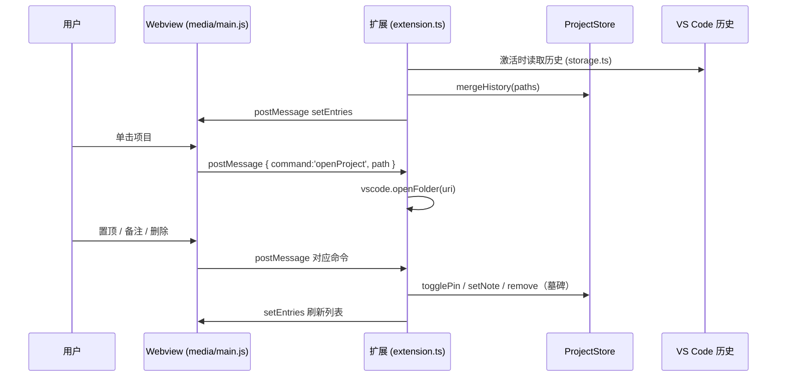

# 功能

## 已实现功能清单

| 功能 | 入口 / 交互 | 实现位置 |
|---|---|---|
| 最近项目侧边栏视图 | 活动栏「最近项目」图标 | `package.json` views；[view.ts](../src/view.ts) |
| 手动刷新 | 视图标题栏刷新按钮 / 命令 `recentProject.refresh` | [extension.ts:31](../src/extension.ts#L31) |
| 当前窗口打开 | 单击列表项 | `vscode.openFolder` + `forceNewWindow:false`，[extension.ts:143](../src/extension.ts#L143) |
| 新窗口打开 | `Ctrl`/`Cmd`+单击 | 同上，`forceNewWindow:true` |
| 置顶 / 取消置顶 | 星标按钮，置顶项排最前且星标金色 | [store.ts:86](../src/store.ts#L86) |
| 编辑 / 清除备注 | 编辑按钮 → 输入框（留空清除） | [extension.ts:158](../src/extension.ts#L158) |
| 从列表移除 | 删除按钮，走「墓碑」防止再读历史时复活 | [store.ts:96](../src/store.ts#L96) |
| 搜索过滤 | 顶栏输入框，按 名称/路径/备注 过滤 | `media/main.js` |
| 显示最后编辑时间 | 扩展递归扫描文件夹内最新 `mtime`（上限 2000 项） | [extension.ts:76](../src/extension.ts#L76) |
| 无效项目自动隐藏 | 文件夹不存在则标记 `missing` 不渲染 | [extension.ts:57](../src/extension.ts#L57) |
| 中英文文案 | 清单 `package.nls*.json`；Webview [i18n.ts](../src/i18n.ts) + `media/main.js` |

## 数据来源与优先级

读取时按 `AppKind`（`code` → `insiders` → `vscodium` → `cursor`）逐一尝试，同一来源内按以下优先级（「最近优先」）：

1. `User/globalStorage/state.vscdb` → 键 `history.recentlyOpenedPathsList`（经典键，Cursor / Insiders / 旧版 VS Code）
2. 同库键 `sessions.recentlyPickedWorkspaces`
3. `User/globalStorage/storage.json` → `profileAssociations.workspaces`（URI → profile 表）
4. 同文件 `windowsState.openedWindows` 与 `backupWorkspaces.folders`

> 各 profile 的 `globalStorage/state.vscdb` 也会一并读取。具体实现见 [storage.ts:91](../src/storage.ts#L91)。

## 数据合并与排序

- 插件自身把历史路径合并进 `globalState`（键 `recentProject.entries`），合并时历史提供「最近打开」排序线索，`globalState` 提供备注 / 置顶 / 墓碑。
- 合并用**单调递增时间戳**（`nextStamp`），保证同一毫秒内的合并顺序稳定。
- 展示排序：**置顶优先 → 按最后编辑时间倒序**（`lastEditedAt` 缺省回退到打开时间）。见 [extension.ts:64](../src/extension.ts#L64)。

## 交互流程

